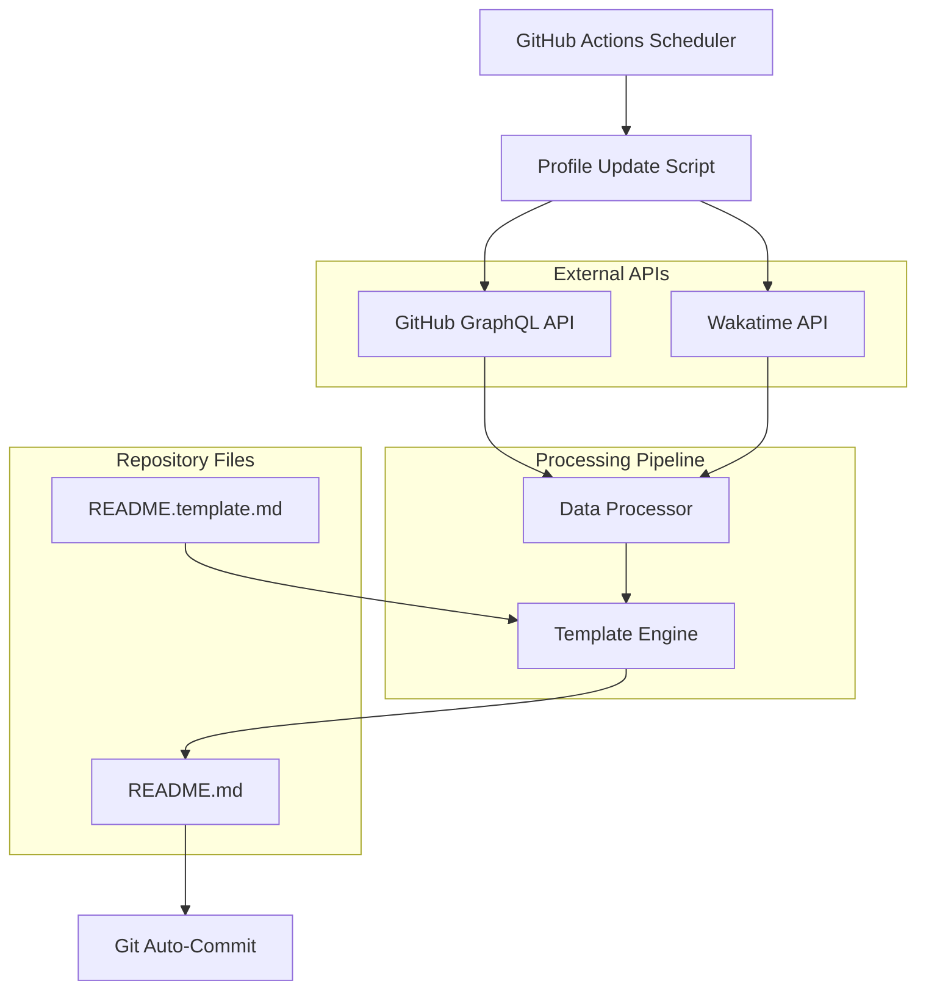

# Design Document

## Overview

Profile Dynamo is an automated GitHub profile README generator that leverages GitHub Actions, external APIs, and template processing to create dynamic, up-to-date profile content. The system follows a pipeline architecture where data flows from multiple sources through processing stages to generate a final README file.

The system operates on a scheduled basis (weekly) and is designed to be resilient, maintainable, and extensible. It uses a template-based approach for content generation, allowing for easy customization while maintaining consistency.

## Architecture

### High-Level Architecture



### Component Architecture

The system follows a modular design with clear separation of concerns:

1. **Orchestration Layer**: GitHub Actions workflow
2. **Data Layer**: API clients for GitHub and Wakatime
3. **Processing Layer**: Data transformation and formatting
4. **Presentation Layer**: Template engine and content generation
5. **Storage Layer**: File system operations

## Components and Interfaces

### 1. GitHub Actions Workflow (`profile-update.yml`)

**Purpose**: Orchestrates the entire update process on a scheduled basis.

**Key Responsibilities**:
- Trigger execution on cron schedule (weekly)
- Set up Python environment and dependencies
- Execute the main script with secure environment variables
- Handle git operations for committing changes

**Configuration**:
```yaml
# Trigger: Every Sunday at 05:00 UTC
schedule:
  - cron: '0 5 * * 0'

# Environment variables from secrets
env:
  WAKATIME_API_KEY: ${{ secrets.WAKATIME_API_KEY }}
  GH_TOKEN: ${{ secrets.GH_TOKEN }}
```

### 2. Main Script (`scripts/update_profile.py`)

**Purpose**: Central coordinator that orchestrates data fetching, processing, and README generation.

**Interface**:
```python
class ProfileUpdater:
    def __init__(self, github_token: str, wakatime_key: str)
    def run(self) -> None
    def _fetch_all_data(self) -> Dict[str, Any]
    def _process_data(self, raw_data: Dict) -> Dict[str, str]
    def _generate_readme(self, processed_data: Dict) -> None
```

### 3. GitHub API Client (`github_client.py`)

**Purpose**: Handles all interactions with GitHub GraphQL API.

**Interface**:
```python
class GitHubClient:
    def __init__(self, token: str)
    def fetch_profile_stats(self) -> Dict[str, Any]
    def fetch_pinned_repositories(self) -> List[Dict]
    def fetch_language_stats(self) -> Dict[str, int]
    def _execute_graphql_query(self, query: str) -> Dict
```

**GraphQL Query Structure**:
```graphql
query {
  viewer {
    contributionsCollection {
      totalCommitContributions
      totalPullRequestContributions
      totalIssueContributions
    }
    pinnedItems(first: 5, types: [REPOSITORY]) {
      nodes {
        ... on Repository {
          name
          description
          url
          primaryLanguage { name }
          stargazerCount
        }
      }
    }
    repositories(first: 100, ownerAffiliations: OWNER) {
      nodes {
        languages(first: 10) {
          edges {
            size
            node { name }
          }
        }
      }
    }
  }
}
```

### 4. Wakatime API Client (`wakatime_client.py`)

**Purpose**: Fetches coding activity data from Wakatime API.

**Interface**:
```python
class WakatimeClient:
    def __init__(self, api_key: str)
    def fetch_coding_stats(self, range: str = "last_7_days") -> Dict[str, Any]
    def _make_request(self, endpoint: str, params: Dict) -> Dict
```

**API Endpoint**: `https://wakatime.com/api/v1/users/current/summaries`

### 5. Data Processor (`data_processor.py`)

**Purpose**: Transforms raw API data into formatted, human-readable content.

**Interface**:
```python
class DataProcessor:
    def process_github_data(self, github_data: Dict) -> Dict[str, str]
    def process_wakatime_data(self, wakatime_data: Dict) -> Dict[str, str]
    def format_time_duration(self, seconds: int) -> str
    def generate_language_bar_chart(self, languages: Dict, total_time: int) -> str
    def format_number(self, number: int) -> str
```

### 6. Template Engine (`template_engine.py`)

**Purpose**: Handles template loading and placeholder replacement.

**Interface**:
```python
class TemplateEngine:
    def __init__(self, template_path: str = "README.template.md")
    def load_template(self) -> str
    def populate_template(self, template: str, data: Dict[str, str]) -> str
    def save_readme(self, content: str, output_path: str = "README.md") -> None
```

**Placeholder Format**:
- `{WAKATIME_STATS}`: Formatted coding time statistics
- `{GITHUB_LANGUAGES}`: Top programming languages bar chart
- `{CONTRIBUTION_STATS}`: GitHub contribution numbers
- `{PINNED_REPOS}`: Formatted list of pinned repositories

## Data Models

### GitHub Data Model

```python
@dataclass
class GitHubStats:
    total_contributions: int
    total_prs: int
    total_issues: int
    pinned_repos: List[PinnedRepository]
    top_languages: Dict[str, int]

@dataclass
class PinnedRepository:
    name: str
    description: str
    url: str
    primary_language: str
    stars: int
```

### Wakatime Data Model

```python
@dataclass
class WakatimeStats:
    total_seconds: int
    languages: List[LanguageTime]
    editors: List[EditorTime]
    operating_systems: List[OSTime]

@dataclass
class LanguageTime:
    name: str
    total_seconds: int
    percentage: float
```

### Processed Data Model

```python
@dataclass
class ProcessedData:
    wakatime_summary: str
    language_chart: str
    contribution_summary: str
    pinned_repos_list: str
    last_updated: str
```

## Error Handling

### API Error Handling Strategy

1. **Retry Logic**: Implement exponential backoff for transient failures
2. **Fallback Content**: Use placeholder text when APIs are unavailable
3. **Graceful Degradation**: Continue processing even if one API fails
4. **Rate Limit Handling**: Respect API rate limits and wait when necessary

### Error Handling Implementation

```python
class APIError(Exception):
    pass

class RateLimitError(APIError):
    pass

def with_retry(max_attempts: int = 3, backoff_factor: float = 2.0):
    def decorator(func):
        def wrapper(*args, **kwargs):
            for attempt in range(max_attempts):
                try:
                    return func(*args, **kwargs)
                except (requests.RequestException, APIError) as e:
                    if attempt == max_attempts - 1:
                        logger.error(f"Final attempt failed: {e}")
                        return None
                    wait_time = backoff_factor ** attempt
                    time.sleep(wait_time)
            return None
        return wrapper
    return decorator
```

### Fallback Content Strategy

```python
FALLBACK_CONTENT = {
    "WAKATIME_STATS": "📊 Coding stats temporarily unavailable",
    "GITHUB_LANGUAGES": "🔧 Language stats will be updated soon",
    "CONTRIBUTION_STATS": "📈 Contribution data loading...",
    "PINNED_REPOS": "📌 Repository information coming soon"
}
```

## Testing Strategy

### Unit Testing

1. **API Clients**: Mock external API responses to test data parsing
2. **Data Processor**: Test formatting functions with various input scenarios
3. **Template Engine**: Verify placeholder replacement and file operations
4. **Error Handling**: Test retry logic and fallback mechanisms

### Integration Testing

1. **End-to-End Pipeline**: Test complete flow with mock APIs
2. **GitHub Actions**: Validate workflow execution in test environment
3. **Template Processing**: Verify final README generation with real templates

### Test Structure

```python
# tests/test_github_client.py
class TestGitHubClient:
    def test_fetch_profile_stats_success(self, mock_requests)
    def test_fetch_profile_stats_api_error(self, mock_requests)
    def test_rate_limit_handling(self, mock_requests)

# tests/test_data_processor.py
class TestDataProcessor:
    def test_format_time_duration(self)
    def test_generate_language_bar_chart(self)
    def test_format_number_with_commas(self)

# tests/test_template_engine.py
class TestTemplateEngine:
    def test_load_template_success(self)
    def test_populate_template_all_placeholders(self)
    def test_populate_template_missing_placeholders(self)
```

### Continuous Integration

- Run tests on every pull request
- Test against multiple Python versions (3.8, 3.9, 3.10)
- Validate GitHub Actions workflow syntax
- Check code quality with linting tools (flake8, black, mypy)

## Security Considerations

### Secret Management

1. **GitHub Secrets**: Store all API keys in repository secrets
2. **Environment Variables**: Pass secrets as environment variables to scripts
3. **No Hardcoding**: Never commit API keys or tokens to repository
4. **Minimal Permissions**: Use tokens with least required permissions

### API Security

1. **Token Scopes**: GitHub token limited to `repo` and `user` scopes
2. **HTTPS Only**: All API communications over HTTPS
3. **Input Validation**: Sanitize all API responses before processing
4. **Rate Limiting**: Respect API rate limits to avoid blocking

### Workflow Security

1. **Restricted Actions**: Use pinned versions of GitHub Actions
2. **Limited Permissions**: Workflow runs with minimal required permissions
3. **Secure Checkout**: Use official checkout action with specific version
4. **Branch Protection**: Protect main branch from direct pushes